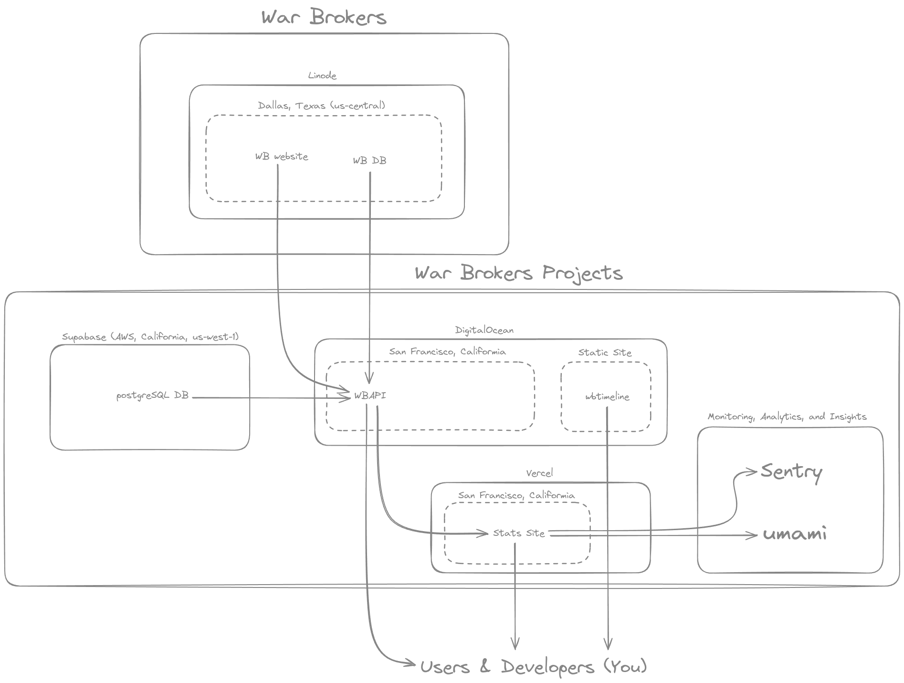

# Contribution guide

## Contributor standard

All WBP contributors are expected to:

- join the [WBP Discord server][discord-invite]
- link their GitHub account to their Discord account
- create a `README.md` file documenting how to set up their project
- sign their git commits (see [GitHub documentation](https://docs.github.com/en/authentication/managing-commit-signature-verification/about-commit-signature-verification))

## Getting started with git for new contributors

Get familiar with the following git concepts:

- [repository](https://www.atlassian.com/git/tutorials/setting-up-a-repository)
- [branch](https://www.atlassian.com/git/tutorials/using-branches)
- [commit](https://www.atlassian.com/git/tutorials/saving-changes/git-commit)
- [pull request](https://www.atlassian.com/git/tutorials/making-a-pull-request)
- [rebase](https://www.atlassian.com/git/tutorials/rewriting-history/git-rebase)
- [diff](https://www.atlassian.com/git/tutorials/saving-changes/git-diff)

Armed with these knowledge, you should be able to resolve problems such as merge
conflicts and use tools such as
[lazygit](https://github.com/jesseduffield/lazygit) more effectively.

## Online infrastructure

## Getting started

Everything in this repository is put there under the assumption that the viewer
is a developer. If you are **NOT** a developer, but would like to contribute to
the project, head over to our [Discord server][discord-invite] and share your
suggestions and bug reports with us!

If you are a developer who want to get their hands dirty, begin by familiarizing
yourself with the following:

- code management
  - VCS (git & GitHub)
  - unit testing with [jest](https://jestjs.io)
  - end-to-end web app testing with [playwright](https://playwright.dev)
  - monorepo management with [turborepo](https://turbo.build/repo)
  - development environment setup with [devenv](https://devenv.sh/getting-started)
    - and by extension [direnv](https://devenv.sh/automatic-shell-activation) and [nix](https://nix.dev/tutorials/nix-language)
  - formatting with [prettier](https://prettier.io)
  - linting with [eslint](https://eslint.org)
  - [vscode](https://code.visualstudio.com)
- web
  - HTML + CSS + JS
  - OSI model
  - Critical Rendering Path
  - rendering strategies
    - Server-side Rendering (SSR)
    - Static Site Generation (SSG)
    - Client-side Rendering (CSR)
- nodejs ecosystem
  - [Node.js](https://nodejs.org)
  - [javascript](https://developer.mozilla.org/en-US/docs/Web/JavaScript)
  - [typescript](https://typescriptlang.org)
  - [react](https://github.com/facebook/react)
  - [next.js](https://github.com/vercel/next.js)
  - [svelte](https://svelte.dev) and [sveltekit](https://kit.svelte.dev)
  - [express](https://github.com/expressjs/express)
  - [trpc](https://github.com/trpc/trpc)

Note that the list above is non-exhaustive. Don't get discouraged though. You
can always learn as you go, and members of our [discord server][discord-invite]
can help you if you get stuck at any point.

## Getting started for real

1. Clone this git repository
2. [setup devenv](https://devenv.sh/getting-started/)
3. Create `apps/wbapi/.env` (you can simply copy `apps/wbapi/.env.example` for testing locally)
4. Run `devenv up` to automagically build and launch the following services
   - http://localhost:5432 - WBAPI postgres DB
   - http://localhost:4000 - WB DB
   - http://localhost:5000 - wbapi
   - http://localhost:5173 - stats site
   - http://localhost:3000 - wbtimeline

[discord-invite]: https://discord.com/invite/synPSeuNFK
