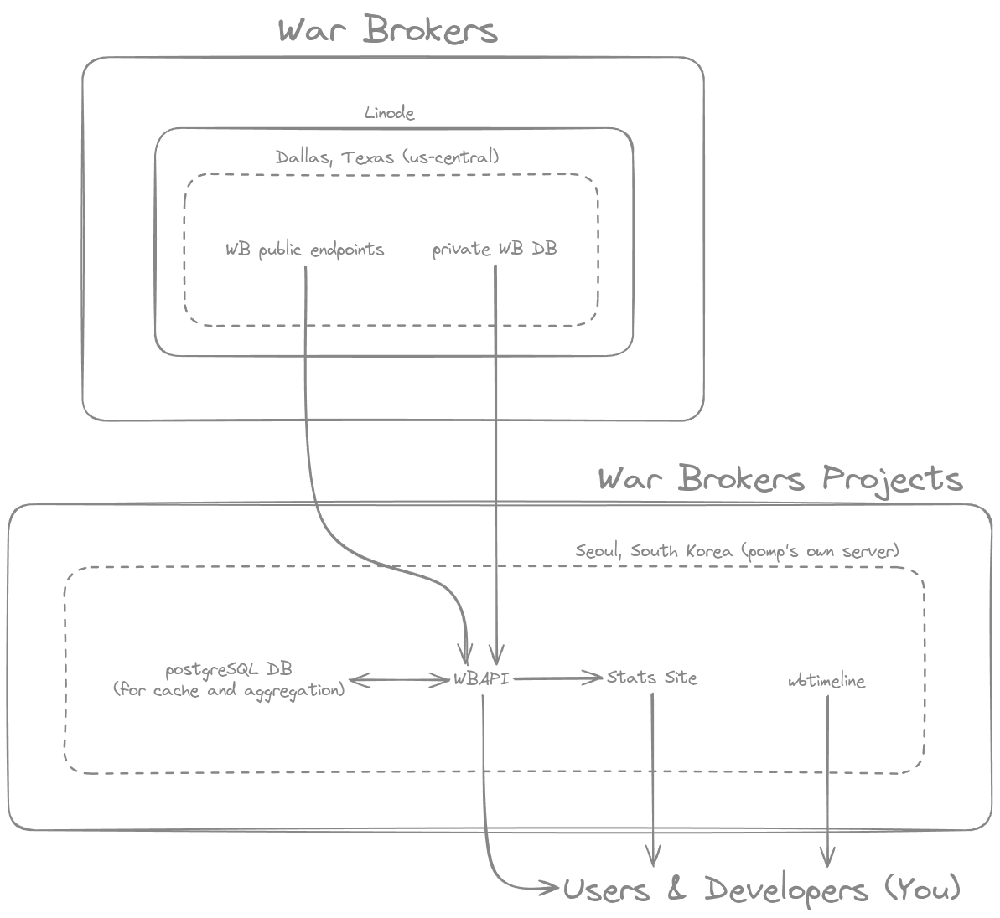

# Contribution guide

## Online infrastructure

## Getting started

1. Clone this git repository.
2. [Install mise](https://mise.jdx.dev/installing-mise.html) and [Nix](https://nixos.org/download/).
3. Create `apps/wbapi/.env` (you can simply copy `apps/wbapi/.env.example` for testing locally).
4. Run `mise install` to install Node.js, pnpm, and PostgreSQL.
5. Run `mise dev` to install dependencies and launch the following services:
   - http://localhost:5432 - WBAPI postgres DB
   - http://localhost:4000 - WB DB
   - http://localhost:5000 - wbapi
   - http://localhost:5173 - stats site
